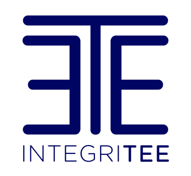

**1. Integritee là gì?**
---

Integritee là 1 framework cho [Parity Substrate](https://docs.substrate.dev/) (liên hệ team **33-Substrate Polkadot** trong trường hợp bạn muốn study thêm về Substrate :D).

Integritee cho phép chúng ta gọi 1 function chuyển đổi trạng thái tùy chỉnh (custom *state transition function* - viết tắt **STF**) ngay bên trong môi trường thực thi đáng tin cậy (Trusted Execution Environment - TEE), cụ thể là bên trong vỏ bọc Intel SGX vì thể nó cung cấp tính bảo mật cũng như toàn vẹn. Các vỏ bọc (enclaves) hoạt động trong 1 vùng trạng thái được mã hóa, nơi mà chỉ có thể được đọc và ghi bởi 1 tập các vỏ bọc đã được cung cấp và chứng thực từ xa rồi.

Vậy thì mục đích sinh ra cái framework này để làm gì? Xem tiếp mục 2 xem nó claim gì nhé.

**2. Integritee hướng tới các chức năng sau:**
---

- Cung cấp các functions chuyển đổi trạng thái phi tập trung bảo mật cho:
    - các giao dịch riêng tư kín đáo
    - các smart constracts riêng tư 
    - các thông tin dữ liệu cá nhân của người dùng được xử lý bảo mật off-chain ([GDPR](./appendix.md#gpdr))
    - định danh phi tập trung với tiêu chí tiết lộ có chọn lọc.
    - các mạng phân phối nội dung dựa trên việc đăng ký.
- khả năng mở rộng (scalability) bằng cách cung cấp 2nd-layer cho các blockchain dựa trên Substrate platform:
    - off-chain smart contracts
    - payment hubs

**3. Tổ chức đứng sau Integritee framework là ai?**
---
Integritee được duy trì bởi [Integritee AG](https://intgeritee.network/) và ban đầu được phát triển bởi [Supercomputing Systems AG](https://www.scs.ch/), cũng như được hỗ trợ bằng các khoản tài trợ từ [Web3 Foundation](https://web3.foundation/)

Integritee cũng gửi lời cảm ơn đến các đội ngũ ở: 
- [Parity Technologies](https://www.parity.io/) cho việc xây dựng [Substrate](https://github.com/paritytech/substrate) và hỗ trợ team trong suốt quá trình phát triển framework này.

- [Teaclave's Rust-SGX-SDK](https://github.com/apache/incubator-teaclave-sgx-sdk) cho sự hỗ trợ và đóng góp tận tình của họ. (p/s: bộ sdk này theo mình biết cũng được sử dụng trong [Secret Network core](https://github.com/enigmampc/SecretNetwork))

**4. Vài lời ngỏ**
---
- Cảm ơn a Thạnh đã gửi cho team mình nguồn tài liệu khá hay về TEE. Về cơ bản book này đang trong quá trình vừa dịch vừa tóm tắt lại theo cách hiểu cũng như sẽ include vài notes của mình trong đó. Nếu có chỗ nào chưa chính xác, welcome PR nhé.
- Sẽ có 1 số từ mình muốn giữ nguyên gốc tiếng anh thay vì dịch ra, vì mình thấy nó mất ý hay của từ gốc cũng như chưa chắc đảm bảo dịch ra dễ hiểu hơn mình để nguyên, nên mình sẽ để y nguyên gốc tiếng anh nếu được.

**5. Resource**
---
- Trích xuất và biên soạn từ Bản gốc tiếng Anh ở [đây](https://book.integritee.network)