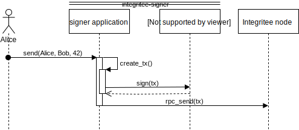
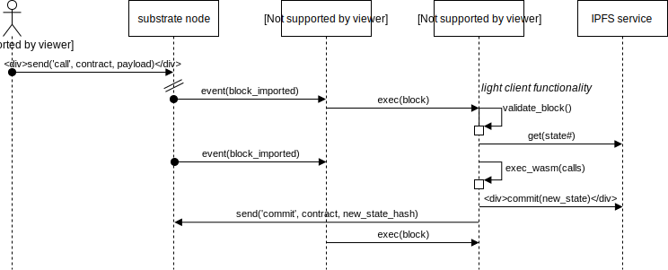

# Vậy TEE sử dụng để làm gì? (In-progress)

Trong sách gốc liệt kê ra 1 vài ý tưởng ban đầu. Không phải tất cả chúng đều đã được triển khai.

## Các cách khác nhau để tận dụng TEEs

| use case | integritee-signer  (off-chain stateless) | integritee-worker  (off-chain stateful) | integritee-node  (onchain stateful) |
|----------|-------------------|----------------|-----------------|
|ví cứng| :+1: TEE cục bộ đối với mỗi người dùng | | 👎|
|hoán đổi nguyên tử (cross-chain bridge)| :+1: node sáng trên cả 2 chains | | 👎 |
|coinmixer| :+1:  | 👎 | 👎 |
|oracle| :+1: | :+1: | khó nếu không xác định |
|công chứng kế thừa| :+1: | :+1: | lưu trữ đắt |
|các giao dịch tuyệt mật| 👎 | 👎 scale được không? (đụng độ các thay đổi trạng thái) | :+1: [encointer](https://encointer.org) |
| 2nd layer trung tâm thanh toán bí mật (tượng tự như [TeeChan](https://github.com/lsds/Teechain))|  | :+1: | |
| smart contracts bí mật |👎 | :+1: (Ekiden, PDO, [encointer](https://encointer.org)) | thời gian tính toán và lưu trữ khá đắt|
| sự đồng thuận [POET](https://sawtooth.hyperledger.org/docs/core/releases/1.0/architecture/poet.html) | 👎 | 👎 | 👎 |

## substraTEE-signer

- *off-chain*: Không có gì đặc biệt cần được chạy bởi blockchain validators. 

- *stateless*: không có trạng thái nào cần được bảo toàn (onchain - dữ liệu hoặc mã hash) giữa các lần sử dụng.

Bạn có thể xem sequence digram của substraTEE-signer bên dưới:

Một đặc trưng của Integritee framework là một RPC client cho substrate chạy một function chuyển đổi trạng thái (STF) nội trong TEE(Intel SGX).

*Tính năng chính*: bộ giám sát phần cứng đáng tin cậy cho các khóa riêng tư của bạn.

## integritee worker

- *off-chain*: Không có gì đặc biệt cần được chạy bởi blockchain validators. 

- *stateful*: trạng thái cần được bảo toàn (onchain - dữ liệu hoặc mã hash) giữa các lần sử dụng.

Bạn có thể xem sequence digram của integritee worker mô tả bên dưới:

Tương tự nhưng vẫn khá là khác so với [sawtooth PDO](https://github.com/hyperledger-labs/private-data-objects) hay [Ekiden/OasisLabs](https://www.oasislabs.com/)

*Đừng nhẫm lẫn giữ integritee worker với Substrate's [off-chain workers](https://github.com/paritytech/substrate/pull/1942). off-chain worker của Substrate là một phần của codebase của node. Còn intergritee-worker là một giao diện service độc lập substrate node sử dụng RPC hoặc websockets.*

Các Dapps có thể commit các WASM contracts và chạy chính TEE của riêng họ hoặc thuê 1 dịch vụ vỏ bọc để chạy WASM smart contract bí mật trên đó. Các đại diện được chứng thực từ xa trên blockchain (TCB không bao gồm WASM contracts). Chúng phải được feed với trạng thái gần nhất, gọi và tải trọng không rõ ràng. Sau đó chúng được cập nhật trạng thái mà sẽ được ghi ngược lại trên chain.

## integritee-stealth-node

- *on-chain*: blockchain validators chạy function chuyển đổi trạng thái bí mật với mọi bên. Bạn có thể hiểu là chạy bí mật chả ai biết.

- *stateful*: trạng thái cần được bảo toàn (onchain - dữ liệu hoặc mã hash) giữa các lần sử dụng.

Đây là 1 rẽ nhánh của subtrate có 1 Executor chạy trên 1 TEE (Intel SGX)

Tính năng chính: nhiều giao dịch bí mật có thể dược thực hiện với mỗi block.

Bạn có thể xem sequence digram của integritee-stealth-node mô tả bên dưới:

